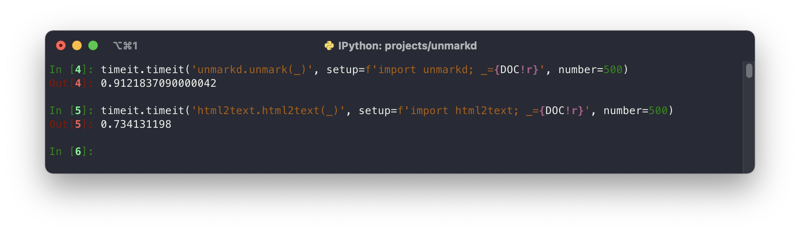
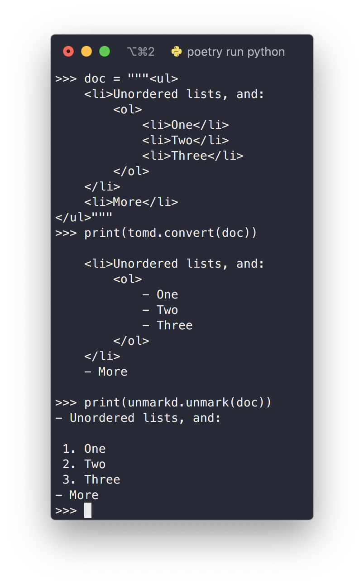
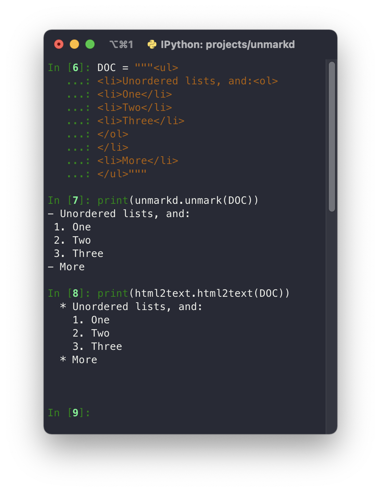

# 🔄 Unmarkd
[](https://codecov.io/gh/ThatXliner/unmarkd) [](https://github.com/psf/black) [](https://github.com/ThatXliner/unmarkd/actions/workflows/ci.yml) [](https://pypi.org/project/unmarkd/)

> A markdown reverser.

---
Unmarkd is a [BeautifulSoup](https://github.com/ThatXliner/unmarkd/issues/4)-powered [Markdown](https://en.wikipedia.org/wiki/Markdown) reverser written in Python and for Python.

## Why

This is created as a [StackSearch](http://github.com/ThatXliner/stacksearch) (one of my other projects) dependency. In order to create a better API, I needed a way to reverse HTML. So I created this.

There are [similar projects](https://github.com/xijo/reverse_markdown) (written in Ruby) ~~but I have not found any written in Python (or for Python)~~ later I found a popular library, [html2text](https://github.com/Alir3z4/html2text). But Unmarkd still is *still* better. See [comparison](#comparison).

## Installation

You know the drill

```bash
pip install unmarkd
```

## Known issues

 - ~~Nested lists are not properly indented ([#4](https://github.com/ThatXliner/unmarkd/issues/4))~~ Fixed in [#11](https://github.com/ThatXliner/unmarkd/pull/11)
 - ~~Blockquote bug ([#18](https://github.com/ThatXliner/unmarkd/issues/18))~~ Fixed in [#23](https://github.com/ThatXliner/unmarkd/pull/23)

## Comparison

**TL;DR: Html2Text is fast. If you don't need much configuration, you could use Html2Text for the little speed increase.**

<details>


<summary>Click to expand</summary>

### Speed

**TL;DR: Unmarkd < Html2Text**

Html2Text is basically faster:



(The `DOC` variable used can be found [here](./assets/benchmark.html))

Unmarkd sacrifices speed for [power](#configurability).

Html2Text directly uses Python's [`html.parser`](https://docs.python.org/3/library/html.parser.html) module (in the standard library). On the other hand, Unmarkd uses the powerful HTML parsing library, `beautifulsoup4`. BeautifulSoup can be configured to use different HTML parsers. In Unmarkd, we configure it to use Python's `html.parser`, too.

But another layer of code means more code is ran.

I hope that's a good explanation of the speed difference.

### Correctness

**TL;DR: Unmarkd == Html2Text**

I actually found *two* html-to-markdown libraries. One of them was [Tomd](https://github.com/gaojiuli/tomd) which had an *incorrect implementation*:



It seems to be abandoned, anyway.

Now with Html2Text and Unmarkd:




In other words, they *work*

### Configurability

**TL;DR: Unmarkd > Html2Text**

This is Unmarkd's strong point.

In Html2Text, you only have a limited [set of options](https://github.com/Alir3z4/html2text/blob/master/docs/usage.md#available-options).

In Unmarkd, you can subclass the `BaseUnmarker` and implement conversions for new tags (e.g. `<q>`), etc. In my opinion, it's much easier to extend and configure Unmarkd.

Unmarkd was originally written as a StackSearch dependancy.

Html2Text has no options for configuring parsing of code blocks. Unmarkd does

</details>

## Documentation

Here's an example of basic usage

```python
import unmarkd
print(unmarkd.unmark("<b>I <i>love</i> markdown!</b>"))
# Output: **I *love* markdown!**
```

or something more complex (shamelessly taken from [here](https://markdowntohtml.com)):

```python
import unmarkd
html_doc = R"""<h1 id="sample-markdown">Sample Markdown</h1>
<p>This is some basic, sample markdown.</p>
<h2 id="second-heading">Second Heading</h2>
<ul>
<li>Unordered lists, and:<ol>
<li>One</li>
<li>Two</li>
<li>Three</li>
</ol>
</li>
<li>More</li>
</ul>
<blockquote>
<p>Blockquote</p>
</blockquote>
<p>And <strong>bold</strong>, <em>italics</em>, and even <em>italics and later <strong>bold</strong></em>. Even <del>strikethrough</del>. <a href="https://markdowntohtml.com">A link</a> to somewhere.</p>
<p>And code highlighting:</p>
<pre><code class="lang-js"><span class="hljs-keyword">var</span> foo = <span class="hljs-string">'bar'</span>;

<span class="hljs-function"><span class="hljs-keyword">function</span> <span class="hljs-title">baz</span><span class="hljs-params">(s)</span> </span>{
   <span class="hljs-keyword">return</span> foo + <span class="hljs-string">':'</span> + s;
}
</code></pre>
<p>Or inline code like <code>var foo = &#39;bar&#39;;</code>.</p>
<p>Or an image of bears</p>
<p></p>
<p>The end ...</p>
"""
print(unmarkd.unmark(html_doc))
```
and the output:

```markdown
    # Sample Markdown


    This is some basic, sample markdown.

    ## Second Heading


    - Unordered lists, and:
     1. One
     2. Two
     3. Three
    - More

    >Blockquote


    And **bold**, *italics*, and even *italics and later **bold***. Even ~~strikethrough~~. [A link](https://markdowntohtml.com) to somewhere.

    And code highlighting:


    ```js
    var foo = 'bar';

    function baz(s) {
       return foo + ':' + s;
    }
    ```


    Or inline code like `var foo = 'bar';`.

    Or an image of bears

    

    The end ...
```
### Extending

#### Brief Overview

Most functionality should be covered by the `BasicUnmarker` class defined in `unmarkd.unmarkers`.

If you need to reverse markdown from StackExchange (as in the case for my other project), you may use the `StackOverflowUnmarker` (or it's alias, `StackExchangeUnmarker`), which is also defined in `unmarkd.unmarkers`.

#### Customizing

If the above two classes do not suit your needs, you can subclass the `unmarkd.unmarkers.BaseUnmarker` abstract class.

Currently, you can *optionally* override the following methods:

 - `detect_language` (parameters: **1**)
    - **Parameters**:
        - html: `bs4.BeautifulSoup`
    - When a fenced code block is approached, this function is called with a parameter of type `bs4.BeautifulSoup` passed to it; this is the element the code block was detected from (i.e. `pre`).
    - This function is responsible for detecting the programming language (or returning `''` if none was detected) of the code block.
    - Note: This method is different from `unmarkd.unmarkers.BasicUnmarker`. It is simpler and does less checking/filtering


But Unmarkd is more flexible than that.

##### Customizable constants

There are currently 3 constants you may override:
 - Formats:
    NOTE: Use the [**Format String Syntax**](https://docs.python.org/3/library/string.html#formatstrings)
     - `UNORDERED_FORMAT`
        - The string format of unordered (bulleted) lists.
     - `ORDERED_FORMAT`
        -  The string format of ordered (numbered) lists.
 - Miscellaneous:
     - `ESCAPABLES`
        - A container (preferably a `set`) of length-1 `str` that should be escaped

##### Customize converting HTML tags

For an HTML tag `some_tag`, you can customize how it's converted to markdown by overriding a method like so:

```python
from unmarkd.unmarkers import BaseUnmarker
class MyCustomUnmarker(BaseUnmarker):
    def tag_some_tag(self, child) -> str:
        ...  # parse code here
```

To reduce code duplication, if your tag also has aliases (e.g. `strong` is an alias for `b` in HTML) then you may modify the `TAG_ALIASES`.

If you really need to, you may also modify `DEFAULT_TAG_ALIASES`. Be warned: if you do so, **you will also need to implement the aliases** (currently `em` and `strong`).

##### Utility functions when overriding

You may use (when extending) the following functions:

 - `__parse`, 2 parameters:
    - `html`: *bs4.BeautifulSoup*
        - The html to unmark. This is used internally by the `unmark` method and is slightly faster.
    - `escape`: *bool*
        - Whether to escape the characters inside the string or not. Defaults to `False`.
 - `escape`: 1 parameter:
    - `string`: *str*
        - The string to escape and make markdown-safe
 - `wrap`: 2 parameters:
    - `element`: *bs4.BeautifulSoup*
        - The element to wrap.
    - `around_with`: *str*
        - The character to wrap the element around with. **WILL NOT BE ESCPAED**
 - And, of course, `tag_*` and `detect_language`.
